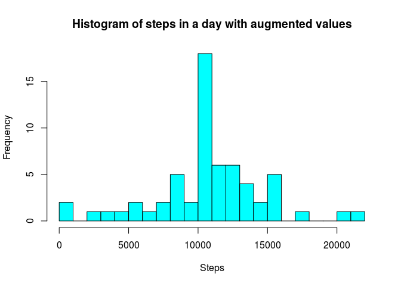

# 𝙿𝙰𝟷_𝚝𝚎𝚖𝚙𝚕𝚊𝚝𝚎
LB  
7 august 2016  

## Loading and preprocessing data


```r
activity_data <- read.csv("activity.csv")
```

### Omitting na rows

```r
activity_no_NA <- na.omit(activity_data)
```

## Steps per day

### Aggregating steps on for days

```r
sinad <- aggregate(steps ~ date, activity_no_NA, sum) 
```

### Drawing a histogram of the number of steps in a day

```r
hist(sinad[,2], breaks=26, col="green", main="Histogram of steps in a day", xlab="Steps")
```

<!-- -->

### Summarizing the steps per day data

```r
summary(sinad[,2])
```

```
##    Min. 1st Qu.  Median    Mean 3rd Qu.    Max. 
##      41    8841   10760   10770   13290   21190
```

## Average daily pattern

### Aggregating data on interval


```r
sinint <- aggregate(steps ~ interval, activity_no_NA, sum) 
```
### Plotting the activity

```r
plot(sinint, type='l', col="blue", main="Activity in time interval in a day")
```

<!-- -->

### Finding the interval with the max value

```r
which.max(sinint[,2])
```

```
## [1] 104
```

```r
sinint[104,]
```

```
##     interval steps
## 104      835 10927
```

## Dealing with missing values

### Counting the number

Use the boolean function is.na, and sum the 1-s to get the number

1. Create a function to look up interval averages depending on the recorded time
2. Mutate activity_data to include the above information in NA cases


```r
library(dplyr)
```

```
## 
## Attaching package: 'dplyr'
```

```
## The following objects are masked from 'package:stats':
## 
##     filter, lag
```

```
## The following objects are masked from 'package:base':
## 
##     intersect, setdiff, setequal, union
```

```r
myf<-function(x){y<-sinint[which(sinint[,1]==x),2];   return (y/61)}
intervals <- sapply(activity_data[,3], myf)
activity_data %>% mutate(steps = ifelse(is.na(steps), intervals  ,steps)) -> activity_data_augment
```

### Making a histogram of the total number of steps taken

```r
augsinad <- aggregate(steps ~ date, activity_data_augment, sum) 
hist(augsinad[,2], breaks=26, col="cyan", main="Histogram of steps in a day with augmented values", xlab="Steps")
```

<!-- -->

```r
summary(augsinad)
```

```
##          date        steps      
##  2012-10-01: 1   Min.   :   41  
##  2012-10-02: 1   1st Qu.: 9354  
##  2012-10-03: 1   Median :10395  
##  2012-10-04: 1   Mean   :10581  
##  2012-10-05: 1   3rd Qu.:12811  
##  2012-10-06: 1   Max.   :21194  
##  (Other)   :55
```

## Weekdays and weekends

### Calculate new aggegrate data on the intervals and put in new factor variable

```r
activity_data_augment %>% mutate(daytype = ifelse( weekdays(as.Date(date))<"Fri" , "weekend", "weekday")) -> activity_data_augment
activity_data_augment %>% mutate(daytype = ifelse(weekdays(as.Date(date))<"Mon" , "weekend", "weekday")) -> activity_data_augment
activity_data_augment$daytype <- as.factor(activity_data_augment$daytype)

augsininit <- aggregate(steps ~ interval, activity_data_augment, sum) 
```

### Separate out factors, and plot them so both the daytype and days intervals can be generated.  Likely possible to do this in one operation.


```r
wd <- activity_data_augment[activity_data_augment$daytype == "weekday",]
we <- activity_data_augment[activity_data_augment$daytype == "weekend",]
wda <- aggregate(steps ~ interval, wd, mean)
wea <- aggregate(steps ~ interval, we, mean)
```

### Create the actual plots

```r
par(mfrow=c(2,1))
plot(wda, type='l', main="Weekdays", col="cyan")
plot(wea, type='l', main="Weekends", col="magenta")
```

<!-- -->


